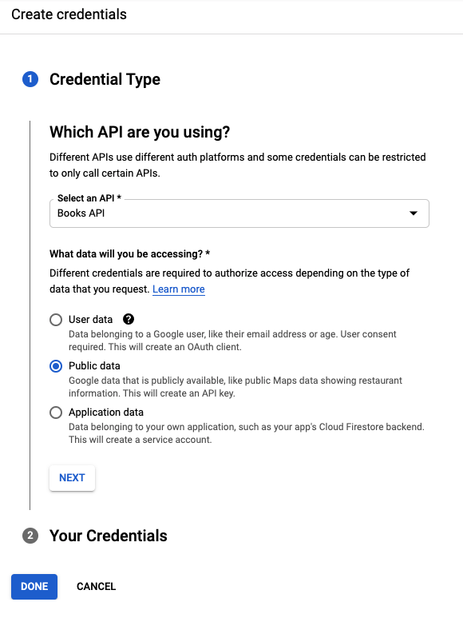
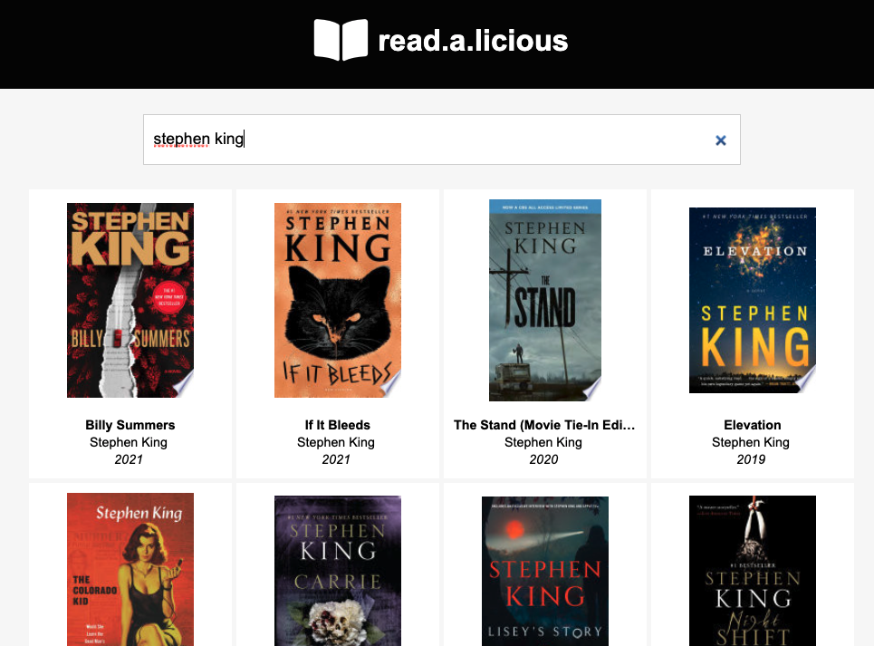

# Project - Google Books API Search Engine

In this project, you will utiilze the Google Books API to implement a book search engine in React.

## Objectives

- Implement a GET HTTP request to a web API.
- Implement a delayed request utilizing the _useEffect_ hook.
- Map API data to a localized application format.
- Understand how to handle error conditions caused by an HTTP request.

## Configuring the Books API

Before working on this project, you will need to set up the Google Books API under your Google account.

1. Sign up for a Google account at https://accounts.google.com/SignUp?hl=en if you don't already have one.
2. Enable the Books API by visiting https://console.cloud.google.com/apis/library/books.googleapis.com. Click "enable" to activate the Books API.
   

3. You will be redirected to a credentials page. Click "Create Credentials".
   

4. Select the "Books API" and select the "Public data" option. Click "Next".
   

5. Click "Done". You will be directed to your newly created API key. Take note of this key. You will use this to access the API in your application.
   

6. For extra security, it is a good idea to limit which APIs your key can access. Click "RESTRICT KEY". On the next screen, select "Restrict key" and select the Books API only. Save your changes.
   

## Project Setup

Clone your copy of this repository to your local environment and then run the following from the project folder in the terminal.

```bash
npm install
npm run start
```

## Instructions

Using the included code as a starting point, you are to create a book search engine named "read.a.licious' utilizing the Google Books API.

When a user first arrives on the search screen, no results are displayed and a message stating "Found nothing to read" should be displayed.


The user may then enter search terms for the books they wish to find in the search input field. Your application should wait for 500ms after the last keystroke before issuing a request to the Books API with the user's search terms. As the data is being requested, a loading message should appear on screen to notify the user that their request is being fulfilled.

Once the repsonse is received from the Books API, the results should be displayed to the user. If the response contains one or more records, the book data should be shown on the screen as below.


If an error occurs, an error message should be shown as below.


## Technical Information

In the past, we have always pushed state up to the _App_ component, however in this project, state is managed by the _BookSearch_ component. You will only need to modify the code in this component to complete the project. In addition, all styles have already been implemented.

The starter code contains a constant _dummyData_ which contains several movies with the data structure needed for the application. This constant should be removed and replaced with a stateful array that will hold the search results returned from the API.

The URL you send to the API should be sent as a GET request and formatted as follows.

```
https://www.googleapis.com/books/v1/volumes?q=USER_INPUT&maxResults=20&key=YOUR_API_KEY
```

You should replace `USER_INPUT` with the search string entered by the user, and `YOUR_API_KEY` with the API key obtained from before. You will need to construct this URL when executing the function you use to send the request. Although it is never a good idea to expose credentials in a React application, we will do so for this project as the risk is minimal (private repository, read-only API key, etc.).

You should also take care to map the data received into an array of objects that contain the attributes that your application expects. To see the format of the data being returned from the API, you may either console.log the parsed response and look in your dev tools, or you may visit a sample request URL (formatted as above) in your browser. The JSON will then be visible for you to inspect in the browser.

The resulting mapped object for each book should have the attributes below. Note that all data you will need can be accessed in the parsed response via its _items_ array attribute.

```
id => response.items[i].id          //string
title => response.items[i].volumeInfo.title    //string
authors => response.items[i].volumeInfo.authors //array of strings
publishedDate => response.items[i].volumeInfo.publishedDate //string representing a date
thumbnail: response.items[i].volumeInfo.imageLinks.thumbnail //string
```

You should check if the `imageLinks` attribute is empty before trying to read the `thumbnail` attribute in the response. Trying to read a non-existent attribute will cause your application to throw an error. There are many records that are returned from this API with an empty `imageLinks` attribute.

I recommend that you first implement the call to the API in response to a user click on a button. This methodology is easier to debug. Once you have this working, you can then refactor your code and implement the delayed query with _useEffect_ (without the click of a button).

## Submission

When finished, make sure to commit your code and then push to GitHub.

```bash
git add .
git commit -m 'Final commit'
git tag -a final -m "Grade Me"
git push --follow-tags
```
